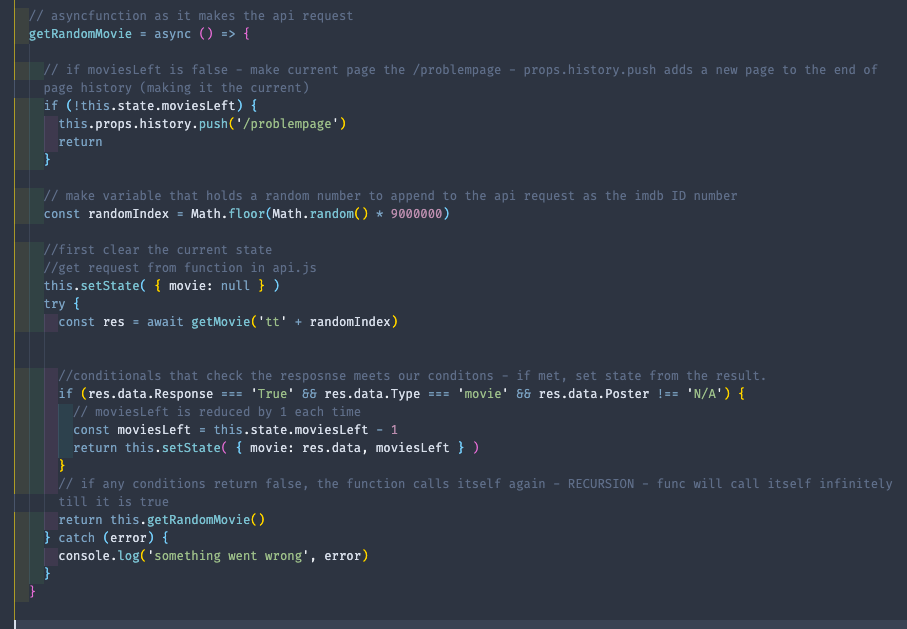

# General Assembly SEI Project 2 - ‘Director Dictator’ 🎬

## View the deployed site here:

[Director Dictator](https://director-dictator.netlify.app/)

## The team:

The project was a team effort along with Siu Kei Tam [Siu Kei Tam ](https://github.com/tams2429) and [Dan Price](https://github.com/Zarathustrah)

## Overview:
Working in a group of three, we came up with the concept of an app that attempted to deal with the indecision that can accompany an excess of choice when picking a film to watch online. The idea was to try and randomly generate a finite selection of films for the user to choose from. They would be presented with them one at a time, and have 5 chances to accept before running out of options and being stuck with the final selection.

Once we found a suitiable API with the [Open Movie Database](https://www.omdbapi.com/), we were able to access all the infomation we needed, like title, genre, rating and poster art, all linked to individual title ID’s from [IMDB](https://imdb.com/) (the Internet Movie Database) to pull in and use in our app.

## Timeframe:
We had just two days to come up with the concept and code the app.

## Technical Brief:
* Group hackathon project in 48hours.
* Create a front-end React app that consumes a public API.

## Technologies:

* HTM5.
* ReactJS.
* JavaScript.
* CSS/SASS.
* Insomnia.
* OMDB API (The Online Movie Database).

## Technical Requirements:
* Group hacakthon project in **48hours**.
* Create a front-end **React** app that consumes an**external API**.
* Be deployed online and be publically accessible.

## Technical Process:

* As this was a group project with a short deadline, we decided to pair code between all three of us for the majority, in order to allow us to all have equal input and to avoid clashing code and minimise the risk of bugs from overlapping code.
* Planning the concept of the app and the basic elements that we would need to get the app functioning.
* Wireframing the visuals.
* Finding and testing an appropriate API.
* Beginning to code and test the basic logic until we got the fundamental parts of the API requests working.
* Adding in the user interface and CSS for the layout.
* Fine tuning the logic, adding conditional rendering and adding final touches before the deadline.
* Deploying the finished app to Netlify.

## Challenges:

The first problem we came across was that the API’s URL for requests wasn’t a single address for an object containing data for a large selection of films (as we had initially expected); instead, it was a URL that needed to be appended with an IMDB ID number for a *specific* title per request. This presented a problem, as we intended to grab a totally random film from the entire database each time, in quick succession, yet we didn’t have immediate access to all of moves to pull infomation from.

Luckily, we were able to source a list of **all** of the titles from the IMDB database sorted by their ID numbers, which gave us something to work with. As we then knew the first and last ID numbers, all we had to do was generate a random number within that range and insert it into our URL each time we made a GET request to the API.

The next issue we had, was that there are over 7,000,0000 titles on IMDB, all organised numerically as an unsorted list of films, TV shows, shorts and more. Nor did all of the entries have info that we wanted, like poster art and a rating etc. To get around this and ensure we only got back titles that were a movie, had a poster, and also had an IMDB rating, we needed to include a series of conditional statements to make sure the responses we were getting back from our requests matched the criteria that we needed, otherwise repeat the request over and over again until we got a successful match.

##### Conditionals for the API request ensuring we got the required response:

## Wins:
The biggest win was fixing the above issue with getting the correct response data back from the API request. Without being able to filter the data like that,  the fundamental concept behind the app would have failed.

It was a really rewarding problem to have been able to fix and showed me some new ideas and ways of problem solving in a team.

## Key Learnings:

Being able to work with others on these new ideas and pair code to share ideas and different ways of looking at problems was a great experience too. I think we all learnt a lot from each other during the course of the project, as we were able to get an equal amount of experience solving problems in all areas of the workload.

I was able to work equally on both the logical elements of the API requests and user interface, as well as styling the CSS and working on things like conditional rendering.

## Demo:

## Resources:
* [The Open Movie Database](https://www.omdbapi.com/)
* [IMDB](https://www.imdb.com/)

