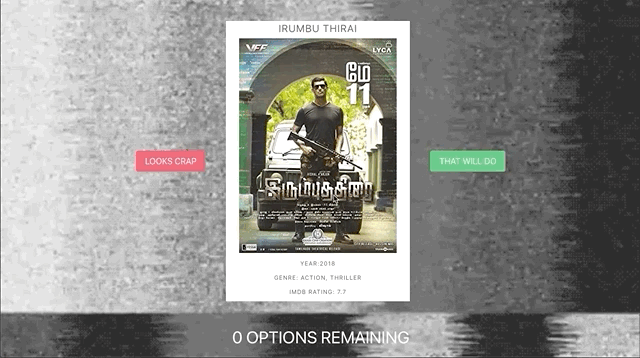

# General Assembly SEI Project 2 - ‘Director Dictator’ 🎬
#General-Assembly/read-me’s

## Technical Brief:
* Group hacakthon project in 48hours.
* Create a front-end React app that consumes a public API.

## Technologies:
* HTM5.
* ReactJS.
* JavaScript.
* CSS/SASS.
* Insomnia.
* OMDB API (The Online Movie Database).

## Demo:

## Overview:
Working in a group of three, we came up with the concept of an app that attempted to deal with the indecision that can accompany an excess of choice when picking a film to watch online. The idea was to try and randomly generate a finite selection of films for the user to choose from. They would be presented with them one at a time and have 5 chances to accept before they ran out of options and were doomed to watch the final selection they were presented with.

Once we found a suitiable API with the [Open Movie Database](https://www.omdbapi.com/), we were able to access all the infomation we needed, like title, genre, rating and poster art, all linked to individual title ID’s from [IMDB](https://imdb.com/) (the Internet Movie Database) to pull in and use in our app.

## Challenges:

The first problem we came across was that the API’s URL for requests wasn’t a single address for an object containing data for a large selection of films (as we had initially expected), instead it was a URL that needed to be appended with an IMDB ID number for a *specific* title per request. This presented a problem, as we intended to grab a totally random film from the entire database each time, in quick sucession, yet we didn’t have immediate access to all of moves to pull infomation from.

Luckily we were able to source a list of **all** of the titles from the IMDB database sorted by their ID numbers, which gave us something to work with. As we then knew the first and last ID numbers, all we had to do was generate a random number within that range and insert it into our URL each time we made a GET request to the API.

The next issue we had, was that there are over 7,000,0000 titles on IMDB, all organised numerically as an unsorted list of films, TV shows, shorts and more. Nor did all of the entries have info that we wanted, like poster art and a rating etc. To get around this and make sure we only got back titles that were a movie, with a poster avaliable and had a rating, we had to include a series of conditional statements to ensure the responses we were getting back from our requests matched the criteria that we needed, otherwise repeat the request over and over again until we got a sucessful match.

## Resources:
* [The Open Movie Database](https://www.omdbapi.com/)
* [IMDB](https://www.imdb.com/)

## The team:

The project was a team effort along with [tams2429 · GitHub](https://github.com/tams2429) and [Zarathustrah · GitHub](https://github.com/Zarathustrah)

## Deployed Site:

[Director Dictator](https://director-dictator.netlify.app/)

